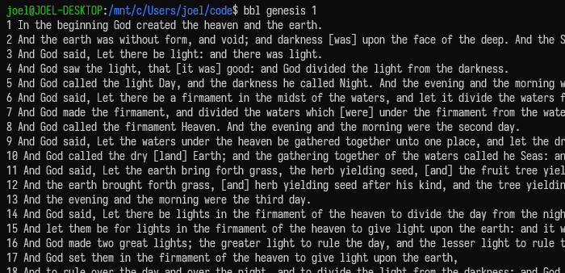

# bbl
A command line tool to read and search the Holy Bible.



## Usage (TL;DR)

```
bbl                                         read Genesis 1 in the default Bible
bbl gen 1                                   read a chapter of default bible
bbl john 3:16                               show a specific verse
bbl matt 7:24-                              from a verse to end of the chapter
bbl matt 28:18-20                           read range of verses
bbl john 3:16 in kjv                        read a verse in specific bible
bbl john 3:16 in kjv tb                     compare kjv and tb
bbl john 3:16 in kjv tb lsg ..              compare 3 or more translations
bbl john 3:16 in en de fr es                specify language name or lang code
bbl search Jesus Christ                     search entire bible by terms
bbl s Jesus Christ limit 3                  specify number of search results
bbl s Jesus Christ in kjv                   search in other version of bible
bbl s Jesus Christ in romans                filter by a book
bbl s Jesus Christ in rom 3                 filter by a chapter
bbl s Jesus in rom 5-12                     filter by chapter range
bbl s Jesus in rom 5-12 in kjv              chapter range and in other bible
bbl s jews gentiles in paul                 filter by category i.e. set of books
bbl s "Jesus wept"                          exact search by double quotation
bbl s "your faith" in gospels               exact search filtered by category
bbl rand (gospels|nt|ot|[category])         random verse from all or part of bible
bbl list (translations|books|categories)    list bibles and filters
bbl (install|uninstall) kjv                 download/delete one or more bible(s)
bbl config ([key]|translation)              show config value of [key]
bbl config ([key] [value]|translation kjv)  set config [key] to [value]
bbl history (read|search|config)            show or filter past commands
bbl help [sub command]                      learn how to use bbl and sub commands
```

Syntax
```
bbl [BOOK] [CHAPTERVERSE] in [TRANSLATION]
bbl search [KEY WORDS] in [BOOK] [CHAPTERVERSE] in [TRANSLATION]
bbl rand [GOSPEL, OT, NT]
bbl list [BOOKS, BIBLES, TRANSLATIONS, CATEGORIES]
```
Examples for BOOK: ```gen, ex, lev, num, josh, jg, ru, 1sm, 2sm, 1k 2k, 1ch, 2ch, ez, ne, job, ps, pr, ec, so, is, je, la, ezk, da, ho, jl, am, ob, jnh, mic, na, hb, zp, hg, zc, mal, matt, mk, lk, jn, act, rom, 1co, 2co, gal, eph, phil, col, 1th, 2th, 1tim, 2tim, tit, phm, heb, jm, 1pt, 2pt, 1jn, 2jn, 3jn, jd, rev```

For full list of available BOOK, run ```bbl list books```

available TRANSLATION: ```webus, kjv, rvr09, tb, delut, lsg, sinod, svrj, rdv24, ubg, ubio, sven, cunp, krv, jc, ayt, th1971, irvhin, irvben, irvtam, npiulb, abtag, kttv, irvguj, irvmar, irvtel, irvurd```

For full descriptions of Bible translations and their installed/downloadable
state, run ```bbl list translations```.

## Installation

### APT

```bash
sudo add-apt-repository ppa:nehemiaharchives/bbl
sudo apt install bbl
```

### Homebrew

```bash
brew install nehemiaharchives/bbl/bbl
```

### Scoop
```powershell
scoop bucket add bbl https://github.com/nehemiaharchives/bbl-scoop-bucket
scoop install bbl
```

### Package Installers

|       | deb | rpm | Arch | Nix | Alpine | macOS | Windows |
|-------| --- | --- | ---- | --- | ------ | ----- | ------- |
| x64   | [deb](https://github.com/nehemiaharchives/bbl/releases/download/v2.0/bbl-v2.0-linux-amd64.deb) | [rpm](https://github.com/nehemiaharchives/bbl/releases/download/v2.0/bbl-v2.0-linux-x86_64.rpm) | [pkg.tar.zst](https://github.com/nehemiaharchives/bbl/releases/download/v2.0/bbl-v2.0-linux-x86_64.pkg.tar.zst) | [flake](https://github.com/nehemiaharchives/bbl/releases/download/v2.0/bbl-v2.0-linux-x64-nix-flake.tar.gz) | [apk](https://github.com/nehemiaharchives/bbl/releases/download/v2.0/bbl-v2.0-linux-x86_64.apk) | [pkg](https://github.com/nehemiaharchives/bbl/releases/download/v2.0/bbl-v2.0-macos-x64.pkg) | [msi](https://github.com/nehemiaharchives/bbl/releases/download/v2.0/bbl-2.0-windows-x64.msi) |
| arm64 | [deb](https://github.com/nehemiaharchives/bbl/releases/download/v2.0/bbl-v2.0-linux-arm64.deb) |  |  |  | [apk](https://github.com/nehemiaharchives/bbl/releases/download/v2.0/bbl-v2.0-linux-aarch64.apk) | [pkg](https://github.com/nehemiaharchives/bbl/releases/download/v2.0/bbl-v2.0-macos-arm64.pkg) |  |

All download links: [v2.0 release](https://github.com/nehemiaharchives/bbl/releases/tag/v2.0).

## Usage

bbl, with no argument/option defaults to output Genesis chapter 1 in World English Bible.

```
bbl
1 In the beginning, God created the heavens and the earth.
2 The earth was formless and empty. Darkness was on the surface of the deep and God’s Spirit was hovering over the su...
3 God said, “Let there be light,” and there was light.
...
31 God saw everything that he had made, and, behold, it was very good. There was evening and there was morning, a six...
```

bbl expects to specify a book and a chapter for reading Bible:
```
bbl ex 1
1 Now these are the names of the sons of Israel, who came into Egypt (every man and his household came with Jacob):
2 Reuben, Simeon, Levi, and Judah,
3 Issachar, Zebulun, and Benjamin,
...
22 Pharaoh commanded all his people, saying, “You shall cast every son who is born into the river, and every daughter...
```
bbl allows to specify a verse:
```
bbl john 3:16
16 For God so loved the world, that he gave his only born  Son, that whoever believes in him should not perish, but h...
```

or a range of verses
```
bbl matt 28:18-20
18 Jesus came to them and spoke to them, saying, “All authority has been given to me in heaven and on earth.
19 Go  and make disciples of all nations, baptizing them in the name of the Father and of the Son and of the Holy Spi...
20 teaching them to observe all things that I commanded you. Behold, I am with you always, even to the end of the age...
```

bbl also let you specify other translation of Bibles such as King James Version by supplying "in {translation}" subcommand.
```
bbl genesis 1 in kjv
1 In the beginning God created the heaven and the earth.
2 And the earth was without form, and void; and darkness [was] upon the face of the deep. And the Spirit of God moved...
3 And God said, Let there be light: and there was light.
...
31 And God saw every thing that he had made, and, behold, [it was] very good. And the evening and the morning were th...
```

## Bible book names
bbl accepts following abbreviation as command argument to specify book as ```bbl list books``` shows:
```
    genesis, gen, ge, gn
    exodus, ex, exod, exo
    leviticus, lev, le, lv
    numbers, num, nu, nm, nb
    deuteronomy, deut, de, dt
    joshua, josh, jos, jsh
    judges, judg, jdg, jg, jdgs
    ruth, rth, ru
    1st samuel, 1 sam, 1sam, 1sm, 1sa, 1s, 1 samuel, 1samuel, 1st sam, first samuel, first sam
    2nd samuel, 2 sam, 2sam, 2sm, 2sa, 2s, 2 samuel, 2ndsam, 2nd sam, second samuel, second sam
    1st kings, 1kings, 1 kings, 1kgs, 1 kgs, 1ki, 1k, 1stkgs, first kings, first kgs
    2nd kings, 2kings, 2 kings, 2kgs, 2 kgs, 2ki, 2k, 2ndkgs, second kings, second kgs
    1st chronicles, 1chronicles, 1 chronicles, 1chr, 1 chr, 1ch, 1stchr, 1st chr, first chronicles, first chr
    2nd chronicles, 2chronicles, 2 chronicles, 2chr, 2 chr, 2ch, 2ndchr, 2nd chr, second chronicles, second chr
    ezra, ezr, ez
    nehemiah, neh, ne
    esther, est, esth, es
    job, jb
    psalms, ps, psalm, pslm, psa, psm, pss
    proverbs, prov, pro, prv, pr
    ecclesiastes, eccles, eccle, ecc, ec, qoh
    song of solomon, song, song of songs, sos, so, canticle of canticles, canticles, cant
    isaiah, isa, is
    jeremiah, jer, je, jr
    lamentations, lam, la
    ezekiel, ezek, eze, ezk
    daniel, dan, da, dn
    hosea, hos, ho
    joel, jl
    amos, am
    obadiah, obad, ob
    jonah, jnh, jon
    micah, mic, mc
    nahum, nah, na
    habakkuk, hab, hb
    zephaniah, zeph, zep, zp
    haggai, hag, hg
    zechariah, zech, zec, zc
    malachi, mal, ml
    matthew, matt, mt
    mark, mrk, mar, mk, mr
    luke, luk, lk
    john, joh, jhn, jn
    acts, act, ac
    romans, rom, ro, rm
    1 corinthians, 1corinthians, 1 cor, 1cor, 1 co, 1co, 1st corinthians, first corinthians
    2 corinthians, 2corinthians, 2 cor, 2cor, 2 co, 2co, 2nd corinthians, second corinthians
    galatians, gal, ga
    ephesians, eph, ephes
    philippians, phil, php, pp
    colossians, col, co
    1 thessalonians, 1thessalonians, 1 thess, 1thess, 1 thes, 1thes, 1 th, 1th, 1st thessalonians, 1st thess, first thessalonians, first thess
    2 thessalonians, 2thessalonians, 2 thess, 2thess, 2 thes, 2thes, 2 th, 2th, 2nd thessalonians, 2nd thess, second thessalonians, second thess
    1 timothy, 1timothy, 1 tim, 1tim, 1 ti, 1ti, 1st timothy, 1st tim, first timothy, first tim
    2 timothy, 2timothy, 2 tim, 2tim, 2 ti, 2ti, 2nd timothy, 2nd tim, second timothy, second tim
    titus, tit, ti
    philemon, philem, phm, pm
    hebrews, heb
    james, jas, jm
    1 peter, 1peter, 1 pet, 1pet, 1 pe, 1pe, 1 pt, 1pt, 1p, 1st peter, first peter
    2 peter, 2peter, 2 pet, 2pet, 2 pe, 2pe, 2 pt, 2pt, 2p, 2nd peter, second peter
    1 john, 1john, 1 jhn, 1jhn, 1 jn, 1jn, 1j, 1st john, first john
    2 john, 2john, 2 jhn, 2jhn, 2 jn, 2jn, 2j, 2nd john, second john
    3 john, 3john, 3 jhn, 3jhn, 3 jn, 3jn, 3j, 3rd  john, third john
    jude, jud, jd
    revelation, rev, re, the revelation
```

## Bible translations
Run ```bbl list``` or just ```bbl ls``` to see which translation is installed or downloadable.

```
WEBUS  | World English Bible               | World English Bible              | English    | 2000 | Available | Public Domain
KJV    | King James Version                | King James Version               | English    | 1611 | Available | Public Domain
RVR09  | Reina-Valera                      | Reina-Valera                     | Spanish    | 1909 | Available | Public Domain
TB     | Brazilian Translation             | Tradução Brasileira              | Portuguese | 1917 | Available | Public Domain
DELUT  | Luther Bible                      | Lutherbibel                      | German     | 1912 | Available | Public Domain
LSG    | Louis Segond                      | Bible Segond                     | French     | 1910 | Available | Public Domain
SINOD  | Russian Synodal Bible             | Синодальный перевод              | Russian    | 1876 | Available | Public Domain
SVRJ   | Statenvertaling Jongbloed edition | Statenvertaling Jongbloed-editie | Dutch      | 1888 | Available | Public Domain
RDV24  | Revised Diodati Version           | Versione Diodati Riveduta        | Italian    | 1924 | Available | Public Domain
UBG    | Updated Gdansk Bible              | Uwspółcześniona Biblia gdańska   | Polish     | 2017 | Available | © 2017 Fundacja Wrota Nadziei (Non-commercial)
UBIO   | Ukrainian Bible, Ivan Ogienko     | Біблія в пер. Івана Огієнка      | Ukrainian  | 1962 | Available | CC BY-SA 4.0 © 1962 Українське Біблійне Товариство
SVEN   | Svenska 1917                      | 1917 års kyrkobibel              | Swedish    | 1917 | Available | Public Domain
CUNP   | Chinese Union Version             | 新標點和合本                     | Chinese    | 1919 | Available | Public Domain
KRV    | Korean Revised Version            | 개역한글                         | Korean     | 1961 | Available | Public Domain
JC     | Japanese Colloquial Bible         | 口語訳                           | Japanese   | 1955 | Available | Public Domain
ABTAG  | Ang Biblia                        | Ang Biblia                       | Tagalog    | 1905 | Available | Public Domain
AYT    | The Opened Bible                  | Alkitab Yang Terbuka             | Indonesian | 2024 | Available | CC BY-NC-SA 4.0 © 2011-2024 YLSA-AYT
KTTV   | Vietnamese Bible 1925             | Kinh Thánh Tiếng Việt            | Vietnamese | 1925 | Available | Public Domain
TH1971 | Thai Bible 1925                   | พระคริสตธรรมคัมภีร์ ฉบับ1971          | Thai       | 1971 | Available | Public Domain
IRVHIN | Indian Revised Version - Hindi    | इंडियन रिवाइज्ड वर्जन - हिंदी        | Hindi      | 2019 | Available | CC BY-SA 4.0 © 2019 Bridge Connectivity Solutions
IRVBEN | Indian Revised Version - Bengali  | ইন্ডিয়ান রিভাইজড ভার্সন - বেঙ্গলী    | Bengali    | 2019 | Available | CC BY-SA 4.0 © 2019 Bridge Connectivity Solutions
IRVMAR | Indian Revised Version - Marathi  | इंडियन रीवाइज्ड वर्जन - मराठी       | Marathi    | 2019 | Available | CC BY-SA 4.0 © 2019 Bridge Connectivity Solutions
IRVTEL | Indian Revised Version - Telugu   | ఇండియన్ రివైజ్డ్ వెర్షన్ - తెలుగు          | Telugu     | 2019 | Available | CC BY-SA 4.0 © 2019 Bridge Connectivity Solutions
IRVTAM | Indian Revised Version - Tamil    | இண்டியன் ரிவைஸ்டு வெர்ஸன் - தமிழ்      | Tamil      | 2019 | Available | CC BY-SA 4.0 © 2019 Bridge Connectivity Solutions
IRVGUJ | Indian Revised Version - Gujarati | ઇન્ડિયન રીવાઇઝ્ડ વર્ઝન ગુજરાતી        | Gujarati   | 2019 | Available | CC BY-SA 4.0 © 2019 Bridge Connectivity Solutions
IRVURD | Indian Revised Version - Urdu     | इंडियन रिवाइज्ड वर्जन - उर्दू         | Urdu       | 2019 | Available | CC BY-SA 4.0 © 2019 Bridge Connectivity Solutions
NPIULB | Nepali Unlocked Literal Bible     | पवित्र बाइबल                      | Nepali     | 2019 | Available | CC BY-SA 4.0 © 2019 Door43 World Missions Community
```

Install one or more packs with:

```
bbl install kjv jc
```
This command will download missing search binary and bbl pack zip files in following locations (supporse username is joel): 

in Windows:
* ```C:\Users\joel\.bbl\bin\bbl-search-common.exe```
* ```C:\Users\joel\.bbl\bin\bbl-search-kuromoji.exe```
* ```C:\Users\joel\.bbl\packs\kjv.zip```
* ```C:\Users\joel\.bbl\packs\jc.zip```

in MacOS
* ```/Users/joel/.bbl/bin/bbl-search-common```
* ```/Users/joel/.bbl/bin/bbl-search-kuromoji```
* ```/Users/joel/.bbl/kjv.zip```
* ```/Users/joel/.bbl/jc.zip```

in Linux
* ```/home/joel/.bbl/bin/bbl-search-common```
* ```/home/joel/.bbl/bin/bbl-search-kuromoji```
* ```/home/joel/.bbl/kjv.zip```
* ```/home/joel/.bbl/jc.zip```

Remove downloaded packs with:

```
bbl uninstall jc
```

## Search
```bbl search {keywords and phrases}``` finds related verses and sorts in order they appear in the Bible. The search is powered by [lucene-kmp](https://github.com/nehemiaharchives/lucene-kmp) code by code [KMP](https://kotlinlang.org/multiplatform/) port of [Apache Lucene](https://github.com/apache/lucene) handling stemming, stopwords providing powerfull full text search engine functionality based on [language specific analzyewrs](https://github.com/nehemiaharchives/lucene-kmp/blob/master/LANGUAGE_COVERAGE.md).
```
bbl search Jesus Christ
matthew 1:1 The book of the genealogy of Jesus Christ, the son of David, the son of Abraham.
matthew 1:16 Jacob became the father of Joseph, the husband of Mary, from whom was born Jesus, who is called Christ.
matthew 1:17 So all the generations from Abraham to David are fourteen generations; from David to the exile to Babylo...
```

bbl search can specify a book
```
bbl search Jesus Christ in romans
romans 1:1 Paul, a servant of Jesus Christ, called to be an apostle, set apart for the Good News of God,
romans 1:4 who was declared to be the Son of God with power according to the Spirit of holiness, by the resurrection ...
romans 1:6 among whom you are also called to belong to Jesus Christ;
```

a chapter
```
bbl search Jesus Christ in romans 3
romans 3:22 even the righteousness of God through faith in Jesus Christ to all and on all those who believe. For ther...
romans 3:24 being justified freely by his grace through the redemption that is in Christ Jesus,
romans 3:26 to demonstrate his righteousness at this present time, that he might himself be just and the justifier of...
```

or a range of chapters
```
bbl search Jesus Christ in romans 4-6
romans 4:24 but for our sake also, to whom it will be accounted, who believe in him who raised Jesus our Lord from th...
romans 5:1 Being therefore justified by faith, we have peace with God through our Lord Jesus Christ;
romans 5:6 For while we were yet weak, at the right time Christ died for the ungodly.
```

translation can be specified too
```
bbl search Jesus Christ in kjv
matthew 1:1 The book of the generation of Jesus Christ, the son of David, the son of Abraham.
matthew 1:16 And Jacob begat Joseph the husband of Mary, of whom was born Jesus, who is called Christ.
matthew 1:17 So all the generations from Abraham to David [are] fourteen generations; and from David until the carryi...
```

book and chapter(s) can be specified together with a translation
```
bbl search Jesus Christ in romans 4-6 in kjv
romans 4:24 But for us also, to whom it shall be imputed, if we believe on him that raised up Jesus our Lord from the...
romans 5:1 Therefore being justified by faith, we have peace with God through our Lord Jesus Christ:
romans 5:6 For when we were yet without strength, in due time Christ died for the ungodly.
```

translation can be specified first before book (and chapter(s))
```
bbl search Jesus Christ in kjv in romans 7-9
romans 7:4 Wherefore, my brethren, ye also are become dead to the law by the body of Christ; that ye should be marrie...
romans 7:25 I thank God through Jesus Christ our Lord. So then with the mind I myself serve the law of God; but with ...

romans 8:1 [There is] therefore now no condemnation to them which are in Christ Jesus, who walk not after the flesh, ...
```

number of search result can be adjusted by writing ```limit 3``` in the search
command or setting ```"searchResult": 3``` in ```config.json```
```
bbl search Jesus limit 3
matthew 1:1 The book of the genealogy of Jesus Christ, the son of David, the son of Abraham.
matthew 1:16 Jacob became the father of Joseph, the husband of Mary, from whom was born Jesus, who is called Christ.
matthew 1:18 Now the birth of Jesus Christ was like this: After his mother, Mary, was engaged to Joseph, before they ...
```

exact phrases can be searched by quoting the phrase:

```
bbl search "Jesus wept"
john 11:35 Jesus wept.
```

search can also compare translations:

```
bbl search Jesus in kjv jc krv limit 3
```

Search filters can use categories as well as books and chapters. Run
```bbl list categories``` to see all category keys.

```
bbl search your faith in gospels
bbl search Adam in nt
bbl search jews gentiles in paul
```

## Categories
Following is the currently supported categories to filter the search result:
```
OLD_TESTAMENT: ot, old testament
TORAH: t, tor, torah, pe, pent, pentateuch
ABRAHAM: abraham
ISAAC: isaac
JACOB: jacob
JOSEPH: joseph
HISTORICAL_BOOKS: h
SAMUEL: sam, samuel
DAVID: david
KINGS: ki, kings
CHRONICLES: chr, chro, chronicles
WISDOM_BOOKS: w, wis, wisdom
PROPHETS: p, prophet, prophets, profets
MAJOR_PROPHETS: map, major, major prophet, major prophets
MINOR_PROPHETS: mip, minor, minor prophet, minor prophets
NEW_TESTAMENT: nt, new testament
GOSPELS: g, go, gospel, gospels
SYNOPTIC_GOSPELS: sg, synoptic, synoptic gospel, synoptic gospels
PAULINE_EPISTLES: paul, pauline, pauline epi, pauline epistle, pauline episodes, letter of paul, letters of paul, paul's letter, paul's letters
CORINTHIANS: cor, corinthians, epistle to the corinthians, letter to the corinthians
THESSALONIANS: thes, thessalonians, epistle to the thessalonians, letter to the thessalonians
TIMOTHY: tim, thimothy, epistle to thimothy, letter to thimothy
PETER: peter, pet, epistle of peter, epistles of peter, letter of peter, letters of peter
JOHN_LETTERS: johnl, johne, johns letter, johns letters, johnsletter, john letter, johnletter, epistle of john, epistles of john, letter of john, letters of john
JOHANNINE: johnw, john writing, johns writings, john writings, johannine
```


## Random Verses
```bbl rand {options}``` randomly shows a verse or a chapter from entire bible, Old Testament, New Testament, or Gospels or other category

default behavior without option first chooses a random book, then from the book chooses a chapter, then a verse from the chapter
```
bbl rand
1 Corinthians 4:17
Because of this I have sent Timothy to you, who is my beloved and faithful child in the Lord, who will remind you of ...
```

random verse from OT
```
bbl rand ot
Ezra 4:5
They hired counselors against them to frustrate their purpose all the days of Cyrus king of Persia, even until the re...
```

random verse from NT
```
bbl rand nt
Romans 12:19
Don’t seek revenge yourselves, beloved, but give place to God’s wrath. For it is written, “Vengeance belongs to me; I...
```

random verse from Gospels (Matthew, Mark, Luke or John)
```
bbl rand g
John 14:11
Believe me that I am in the Father, and the Father in me; or else believe me for the very works’ sake.
```

show random chapter, without specifying chapter, you can always show a whole random chapter by setting ```"randomlyShow": "chapter"``` in ```config.json``` 
```
bbl rand chapter
Romans 12
1 Therefore I urge you, brothers, by the mercies of God, to present your bodies a living sacrifice, holy, acceptable ...
2 Don’t be conformed to this world, but be transformed by the renewing of your mind, so that you may prove what is th...
3 For I say through the grace that was given me, to everyone who is among you, not to think of yourself more highly t...
...
21 Don’t be overcome by evil, but overcome evil with good.
```

## Compare translations

When reading Bible passages, specify multiple translations after `in`:

```
bbl john 3:16 in kjv webus jc
```

You can also specify languages and let bbl choose the default translation for
each language:

```
bbl john 3:16 in en de fr es ja ko zh
```

The default grouping is controlled by:

```
bbl config compareBy block
bbl config compareBy verse
```

## History

```bbl history``` shows past commands. It can be filtered:

```
bbl history
bbl history read
bbl history search
bbl history config
```

History recording is enabled by default. It can be disabled or formatted:

```
bbl config historyEnabled false
bbl config historyFormat command
bbl config historyFormat datetimeCommand
bbl config historyFormat datetimeTimezoneCommand
```

History file is created at:
* ```C:\Users\joel\.bbl\history.json``` in Windows
* ```/Users/joel/.bbl/history.json``` in MacOS
* ```/home/joel/.bbl/history.json``` in Linux

## Configure custom default behavior
bbl, assuming that the username of the computer is "joel", tries to look for ```config.json``` at
* ```C:\Users\joel\.bbl\config.json``` in Windows
* ```/Users/joel/.bbl/config.json``` in MacOS
* ```/home/joel/.bbl/config.json``` in Linux

Create the default config file with:

```
bbl config init
```

Config values can be read or written from the CLI:

```
bbl config translation
bbl config translation kjv
bbl config searchResult 10
bbl config randomlyShow chapter
bbl config header true
```

Config can also be edited directly in ```config.json```:

```json
{
  "translation": "kjv",
  "searchResult": 10,
  "randomlyShow": "chapter",
  "header": false,
  "compareBy": "block",
  "historyEnabled": true,
  "historyFormat": "command"
}
```

## Shell Autocomplete
Package installers such as `.pkg`, Homebrew, `.deb`, `.rpm`, Arch Linux, and Nix install shell autocompletions in the following dirs:

bash:
- macOS `.pkg`: `/usr/local/share/bash-completion/completions/bbl`
- Homebrew: `$(brew --prefix)/etc/bash_completion.d/bbl`
- Ubuntu/Debian family: `/usr/share/bash-completion/completions/bbl`
- RHEL/Fedora family: `/usr/share/bash-completion/completions/bbl`
- Arch Linux: `/usr/share/bash-completion/completions/bbl`
- Nix/NixOS: installed with `installShellCompletion --bash` and auto-activated in a Nix shell/profile

zsh:
- macOS `.pkg`: `/usr/local/share/zsh/site-functions/_bbl`
- Homebrew: `$(brew --prefix)/share/zsh/site-functions/_bbl`
- Ubuntu/Debian family: `/usr/share/zsh/vendor-completions/_bbl`
- RHEL/Fedora family: `/usr/share/zsh/site-functions/_bbl`
- Arch Linux: `/usr/share/zsh/site-functions/_bbl`
- Nix/NixOS: installed with `installShellCompletion --zsh` and auto-activated in a Nix shell/profile

fish:
- macOS `.pkg`: `/usr/local/share/fish/vendor_completions.d/bbl.fish`
- Homebrew: `$(brew --prefix)/share/fish/vendor_completions.d/bbl.fish`
- Ubuntu/Debian family: `/usr/share/fish/vendor_completions.d/bbl.fish`
- RHEL/Fedora family: `/usr/share/fish/vendor_completions.d/bbl.fish`
- Arch Linux: `/usr/share/fish/vendor_completions.d/bbl.fish`
- Nix/NixOS: installed with `installShellCompletion --fish` and auto-activated in a Nix shell/profile

So include them in profile files like this:

### bash
Add one of these lines to `$HOME/.bashrc` (`$HOME/.bash_profile` on macOS if your bash reads that file):

macOS `.pkg`:
```bash
source /usr/local/share/bash-completion/completions/bbl
```

Homebrew:
```bash
source "$(brew --prefix)/etc/bash_completion.d/bbl"
```

Ubuntu/Debian family, RHEL/Fedora family, and Arch Linux:
```bash
source /usr/share/bash-completion/completions/bbl
```

### zsh
Add one of these blocks to `$HOME/.zshrc`:

macOS `.pkg`:
```zsh
fpath=(/usr/local/share/zsh/site-functions $fpath)
autoload -Uz compinit && compinit
```

Homebrew:
```zsh
fpath=("$(brew --prefix)/share/zsh/site-functions" $fpath)
autoload -Uz compinit && compinit
```

Ubuntu/Debian family:
```zsh
fpath=(/usr/share/zsh/vendor-completions $fpath)
autoload -Uz compinit && compinit
```

RHEL/Fedora/Arch Linux:
```zsh
fpath=(/usr/share/zsh/site-functions $fpath)
autoload -Uz compinit && compinit
```

### fish
Add one of these lines to `$HOME/.config/fish/config.fish`:

macOS `.pkg`:
```fish
set -U fish_complete_path /usr/local/share/fish/vendor_completions.d $fish_complete_path
```

Homebrew:
```fish
set -U fish_complete_path (brew --prefix)/share/fish/vendor_completions.d $fish_complete_path
```

Ubuntu/Debian family, RHEL/Fedora family, and Arch Linux:
```fish
set -U fish_complete_path /usr/share/fish/vendor_completions.d $fish_complete_path
```

Nix/NixOS completions are auto-activated when `bbl` is installed in a Nix shell or profile.

### powershell
After instaling bbl on windows, run following to activate powershell completion:

```powershell
$profileDir = Split-Path -Parent $PROFILE
$completion = Join-Path $profileDir "_bbl.ps1"
New-Item -ItemType Directory -Force -Path $profileDir
bbl generate-completion powershell | Out-File -Encoding utf8 -FilePath $completion
Add-Content -Path $PROFILE -Value ". `"$completion`""
. $completion
```

### Generating completion file
`bbl generate-completion [SHELL]` will output completion file for the SHELL, the argument is either `bash`, `zsh`, `fish`, or `powershell`


## Powered by
bbl was made available thanks to following:
* God the Father, Jesus Christ the Son and The Holy Spirit who encouraged me to make this software.
* Command functionality is powered by [Clikt](https://github.com/ajalt/clikt). It validates the input of the number of chapters of a book, emits error when you request more chapter than the book has.
* Search is powered by [lucene-kmp](https://github.com/nehemiaharchives/lucene-kmp), a Kotlin Multiplatform Lucene port developed together with bbl.
* The code is written in [Kotlin](https://kotlinlang.org/) Programming Language.

## Why Kotlin?

1. I was long time Java developper and suffered from JAVA but loved Java, and I met kotlin and it solved all the suffering. So I love Kotlin more than Java now. I have no C, C++, Rust, Go skill. ~~If I had, I haven written bbl in them to prduce single binary. But installation size is smaller than pre-Java 9 application because bbl only includes reqired java modules, not entire JVM. I know Rust is the best. Sorry for inconvenience making installation directory dirty with many binary files.~~ bbl now provides single binary executables by Kotlin Multiplatform and Kotlin/Native. This is a real joy because the original dream of bbl was a small command line Bible tool that can be installed and run as one executable.

2. I think Apache Lucene is the best search library and I used it in old bbl as search provider. I did not want to use DBMS in command line app. However if we use Kotlin/Native we can not use use Lucene as it is. So I went on and port Apache Lucene as kmp library: [lucene-kmp](https://github.com/nehemiaharchives/lucene-kmp) class-by-class, function-by-function port indexing and search capabiilty brought to Kotlin Multiplatform. bbl and lucene-kmp are developed together so bbl can dogfood and improve lucene-kmp search quality. 

3. bbl uses Kotlin Multiplatform so the Bible, translation, and search logic can be shared by the command line tool and app targets.
